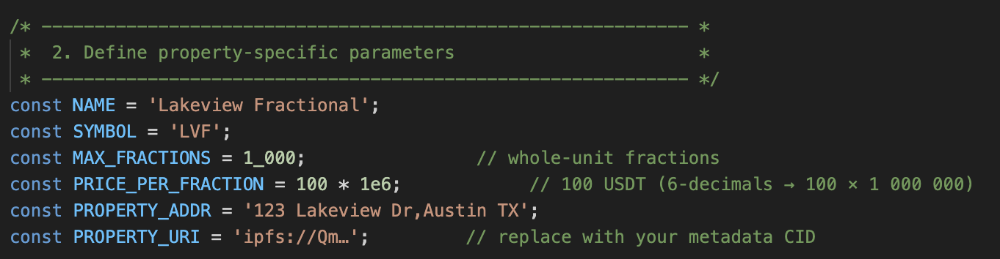

# Real Estate Tokenization Project

The Real Estate Tokenization Project is a sophisticated blockchain-based platform that enables fractional ownership of real estate assets. Built on the TRON blockchain, it facilitates easy buying, selling, and dividend distribution using USDT, significantly increasing market accessibility, liquidity, and transparency.

## Project Overview

This smart contract (`MultiPropertyFractionalAdvanced`) gives an idea for an innovative solution for real estate investment through fractional tokenization, streamlining processes traditionally burdened by paperwork and intermediaries. It automates dividend payouts, supports fractional trades, and provides detailed property metadata.

## Key Features

- **Fractional Ownership**: Divide properties into tradable fractions.
- **USDT Integration**: Transactions and dividend payments conducted using USDT.
- **Automated Dividend Management**: Simple processes for depositing and claiming dividends.
- **Property Metadata**: Store property-specific information securely on-chain.
- **Secure and Efficient**: Uses OpenZeppelin libraries for robust security and ReentrancyGuard for transaction safety.

## Project Structure

- **`MultiPropertyFractionalAdvanced.sol`**: Main Solidity smart contract managing fractional ownership, dividends, and trading.
- **`tronbox.js`**: Configuration file for Tronbox deployments on different environments.
- **`.env`**: Secure file for sensitive configurations and keys.
- **`2_deploy-all.js`**: Deployment script to initialize smart contract deployment.
- **`test.js`**: A complete suite of tests verifying functionality including purchases, sales, and dividends.

## Installation and Setup

### Requirements

- Node.js and npm installed
- TronBox installed globally

### Installation

Clone the repository and install necessary dependencies:

```bash
git clone your_repo_url
cd REALESTATETOKENIZATION
npm install
```

### Environment Configuration

Create a `.env` file in the project's root with:

```env
cp sample-env .env
```

## Deployment

### Configure your deployment script for your RWA contract:

Modify the migrations/2\_deploy\_all.js script depending on your RWA requirements as below example:



### Deploy to your local TRON network:

Pull images from docker (optional if not done before):

```bash
docker pull tronbox/tre
```

Start the Tronbox Runtime Environment

`docker run -it \\ -p 9090:9090 \\ --rm \\ --name tron \\ tronbox/tre`

Deploy the contract

```bash
tronbox migrate --network development
```

### Deploy to the Nile testnet:

```bash
tronbox migrate --network nile
```

## Testing

Run detailed tests using provided scripts:

```bash
node test.js
```

Tests include:

- Fraction buying/selling
- Dividend deposits and claims
- Balance and token validation

## Dependencies

- `@openzeppelin/contracts`: Secure ERC-20 standard and security enhancements
- `tronbox`: Deployment and migration tool
- `tronweb`: Interacting with contracts on the TRON network

## Usage Example

After deployment, users can interact via TronWeb scripts or DApps to manage their real estate investments, ensuring real-time asset management, dividends claiming, and fractions trading.
